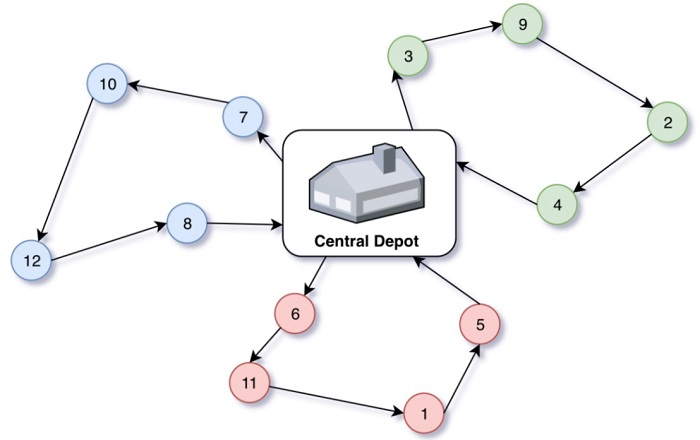

# vehicle-routing-problem

In the Vehicle Routing Problem (VRP), the goal is to find optimal routes for multiple vehicles visiting a set of locations. Each location has a demand that must be delivered, and for the solution to be reached, all locations must have their needs attended to.

This problem has a series of constraints that make it harder to find an optimal solution as the number of nodes increases. To solve this, you need to respect the maximum capacity of each truck that is going to make the delivery, the maximum number of cities you can visit in a route, and ensure that every route starts and finishes at the central depot.

This problem has been approached in three different ways: global search, local search (using heuristics), and a parallel version.

The heuristics used for this problem were the Closest Node heuristic and the Clarke and Wright heuristic.

